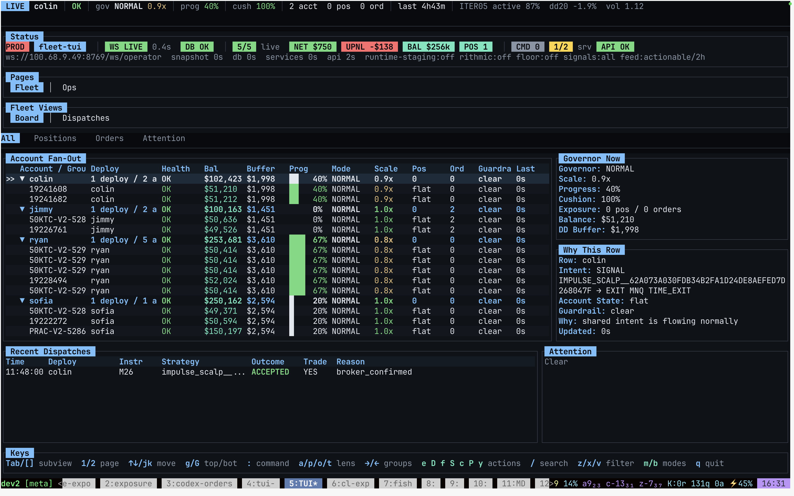
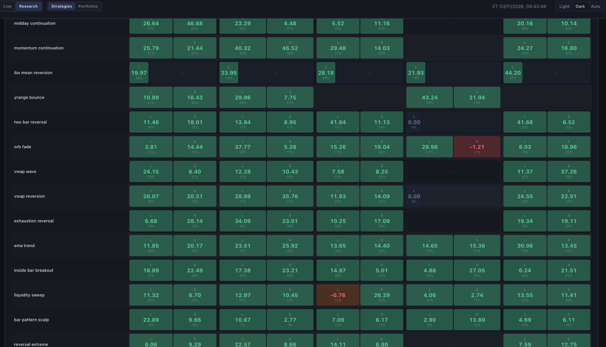
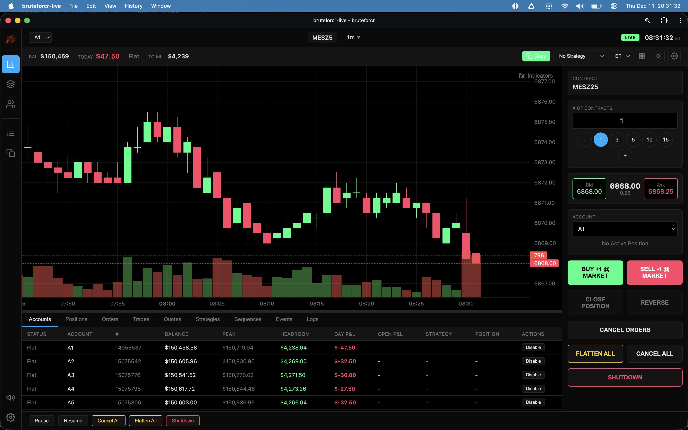
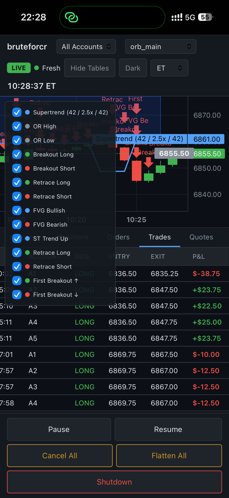

# Bijan

I build trading, data, and automation systems with an emphasis on reproducible research, replayable pipelines, and inspectable strategy behavior.

Recent work is concentrated in prediction markets and systematic trading: market ingestion, event matching, wallet intelligence, backtesting, and runtime infrastructure.

## Trading Systems

I built an internal futures trading workstation for managing multiple funded-style accounts from one operator surface. The system combined execution, copy trading, risk controls, account fan-out, strategy dispatch, live state monitoring, and research workflows.

Key capabilities:

- Managed 10 accounts simultaneously from a single execution and monitoring UI
- Copy-traded orders across account groups with per-account position, balance, drawdown, and guardrail visibility
- Ran hundreds of strategy variants across live and replay workflows
- Backtested thousands of strategy/day/configuration combinations with sortable strategy comparison views
- Supported real-time backtesting, live dispatch review, account health checks, kill switches, flatten/cancel controls, and operator explanations for each action

## Portfolio

- [Aikido Systematic Trading](https://github.com/bijmaxx/aikido-systematic-trading) - Rust-first research, simulation, runtime, and evidence platform for systematic trading.
- [Polymarket Weather Research](https://github.com/bijmaxx/polymarket-weather-research) - Paper-trading research engine for weather markets with market ingestion, signal evaluation, and experiment tracking.
- [Polymarket Trader Intelligence](https://github.com/bijmaxx/polymarket-trader-intelligence) - CLI for wallet alerts, replay, SQLite storage, and trader profile analysis.
- [Matching System](https://github.com/bijmaxx/matching-system) - Explainable event matcher for cross-platform prediction market analysis.
- [Polymarket Oracle Bot](https://github.com/bijmaxx/polymarket-oracle-bot) - Prototype for studying oracle-lag trading behavior in prediction markets.
- [Vector Backtester](https://github.com/bijmaxx/vector-backtester) - ClickHouse-backed cryptocurrency strategy backtester using SQL-native vectorized execution.

## What I Work On

- Trading research infrastructure: ingestion, replay, simulation, and backtesting
- Prediction-market analytics: event matching, wallet intelligence, oracle timing, and market behavior
- Production-minded research tools: CLIs, storage layers, evidence capture, and runtime design
- Automation products: browser extensions, data workflows, and AI-assisted operator tooling

## Stack

Python, Rust, TypeScript, Go, Ruby, ClickHouse, SQLite, Postgres, React, Chrome extensions, CLI tools, and data pipelines.
